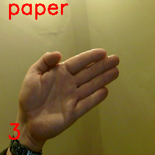

# ROCK PAPER SCISSORS

This model was trained on roughly 60-70 images in each of the of the Rock, Paper, Scissors, and Nothing class.

The input was a desktop webcam, and it uses Googles Teachable Machine to organise the data and train the Image model.

The code provides a count down of three seconds (6, 5, 4) prior to prediction.

My home setup has a usb webcam on a cable sat on my desk, and so there are more image variations from this setup 
than there would be from a laptop webcam which is on a fixed plane.  Because of this I have implemented the final
3 second count down to happen during prediction.
It counts down 3 more seconds (3, 2, 1) during prediction, and prints the prediction to screen for each of those frames
to provide feedback to the user as to what pose the camera is capturing in realtime, before the final prediction is 
sent into the game logic.

# Milestone 3

This code has four function definitions.
get_computer_choice, get_user_choice, get winner, and play.

get_computer_choice randomly selects either rock, paper or scissors from a list

get_user_choice takes user input, turns it all into lower case and passesit out.
It does not do any fancy input checking on the code.
Although, there is a neat way to limit selection here:-
https://stackoverflow.com/questions/37565793/how-to-let-the-user-select-an-input-from-a-finite-list

# Milestone 4
play simply runs the above functions for the gameplay by calling each of them

# Milestone 5
prints to screen the prediction (rock, paper or scissors)
Uses delta time, and prints the time count down to screen

# Further improvements
It would be useful to make it so that you can press a key on the keyboard when
it captures the correct pose whether that be rock, paper or scissors.
So that you can move your hand around, until you get the prediction you want
and then release it into the game.

